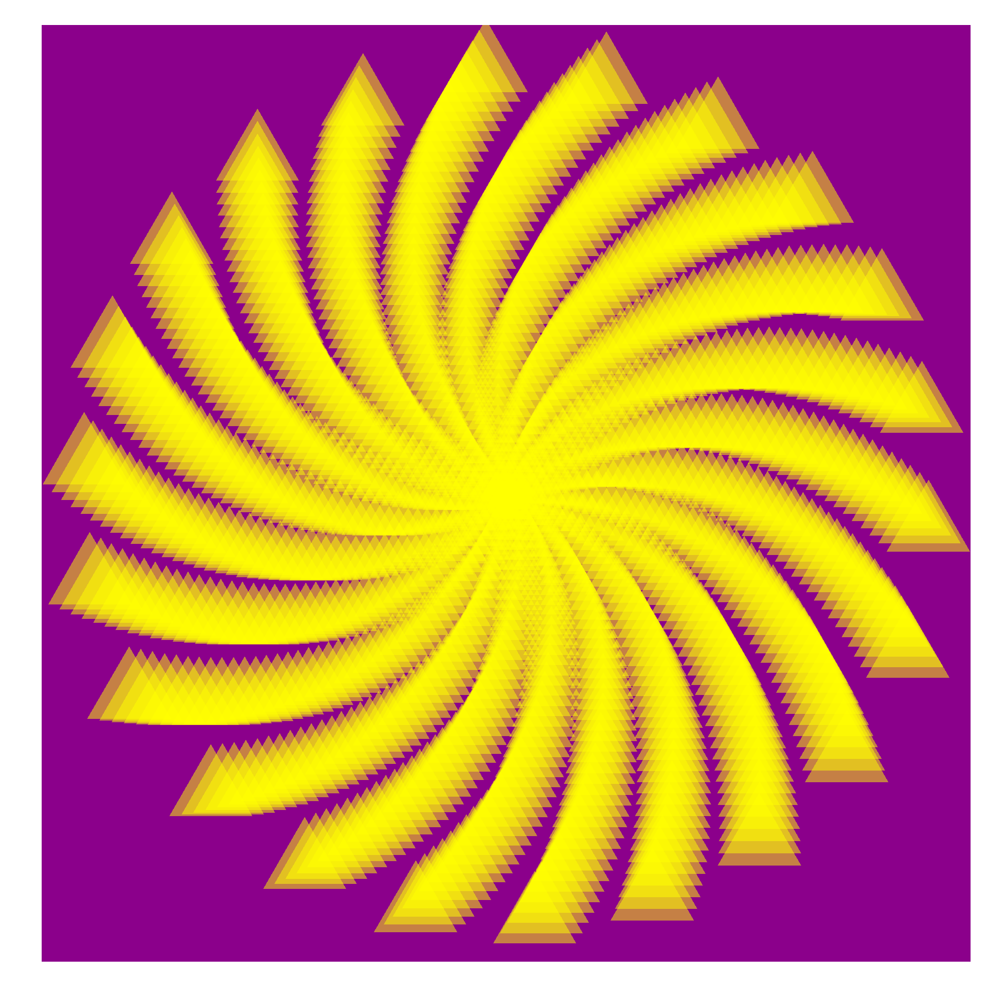

# Generative coding con R (6/4/2019)
## ESTALMAT Madrid

### Cargamos la libreria

Lo primero que tenemos que hacer es cargar `ggplot2`, que es la librería que vamos a utilizar para este taller.

```r
library(ggplot2)
```

### Pintamos unos puntos en un círculo de radio 1

Vamos a calentar pintando puntos en un círculo de radio 1. Para ello elegimos una secuencia de ángulos y medimos su seno y su coseno, que formarán las coordendas `x` e `y` de dichos puntos.

Utilizamos `geom_point` para representarlos y `coord_equal` para que los ejes no se distorsionen.

```r
t <- seq(0, 2*pi, length.out = 50)
x <- sin(t)
y <- cos(t)
df <- data.frame(t, x, y)

ggplot(df, aes(x, y)) +
  geom_point() + 
  coord_equal()
```


### Introducimos el Golden Angle

Como hemos visto, el ángulo áureo vale `pi * (3 - sqrt(5))`. Vamos a separar los putos con ese ángulo. También vamos a hacer que los puntos se vayan alejando del origen de forma que cada uno estará a una distancia de `+1` del anterior. Añadimos unas etiquetas con el orden en que se generan para diefernciarlos y comprobar esto visualmente.


```r
points <- 10 # No. de puntos
angle <- pi * (3 - sqrt(5)) # golden angle

t <- (1:points)
x <- sin(t * angle)
y <- cos(t * angle)
df <- data.frame(t, x, y)

ggplot(df, aes(x*t, y*t)) +
  geom_point() + 
  coord_equal() + 
  geom_text(aes(label=t), vjust = -1, size = 5)
```


### El girasol

Ahora pintamos más puntos y quitamos ejes, *grids* y *background* para que se vean sólo los puntos. La imagen resultante recuerda a un girasol. 

En botánica, phyllotaxis o phyllotaxy es la disposición de las hojas en el tallo de una planta. El nombre proviene de *phýllon* (hoja) y de *táxis* (disposición) en griego antiguo. Las espirales filotácticas forman una clase distintiva de patrones en la naturaleza. El término fue acuñado por Charles Bonnet para describir la disposición de las hojas en una planta.

```r
points <- 200 # No. de puntos
angle <- pi * (3 - sqrt(5)) # golden angle
t <- (1:points)
x <- sin(t * angle)
y <- cos(t * angle)
df <- data.frame(t, x, y)

ggplot(df, aes(x*t, y*t)) +
  geom_point() +
  coord_equal() +
  theme(panel.background = element_rect(fill="white"),
        panel.grid=element_blank(),
        axis.ticks=element_blank(),
        axis.title=element_blank(),
        axis.text=element_blank())
```


### Cambiamos los colores y el tamaño de los puntos

Se puede cambiar el tamaño de los puntos con `size`, el color con `color` y la transparencia con `alpha`. Los colores en R tienen nombre. La lista completa de colores está [aquí](http://www.stat.columbia.edu/~tzheng/files/Rcolor.pdf).

```r
ggplot(df, aes(x*t, y*t)) +
  geom_point(size=8, alpha=0.5, color="darkgreen") +
  coord_equal() + 
  theme(panel.background = element_rect(fill="white"),
        panel.grid=element_blank(),
        axis.ticks=element_blank(),
        axis.title=element_blank(),
        axis.text=element_blank())
```


### El diente de león

También se puede cambiar la forma de los puntos con `shape`. Estas son las formas que se pueden utilizar:


El tamaño de los puntos se puede asociar a alguna de las columnas de nuestra tabla de datos. Esto hace que el tamaño sea variable, y se hace con `aes(size=...)`

```r
ggplot(df, aes(x*t, y*t)) +
  geom_point(aes(size=t), alpha=0.5, shape=8)+
  coord_equal() + 
  theme(legend.position="none",
        panel.background = element_rect(fill="white"),
        panel.grid=element_blank(),
        axis.ticks=element_blank(),
        axis.title=element_blank(),
        axis.text=element_blank())
```


### Jugando con las formas

Algunas formas (como la 21) tienen borde. En este caso, se puede colorear el interior con `fill` y el borde con `colour` separadamente. También se puede modificar el grueso del borde con `stroke`.

```r
points <- 50 # No. de puntos
angle <- pi * (3 - sqrt(5)) # golden angle
t <- (1:points)
x <- sin(t * angle)
y <- cos(t * angle)
df <- data.frame(t, x, y)

ggplot(df, aes(x*t, y*t)) +
  geom_point(shape = 21, colour = "black", 
             fill = "yellow", size = 5, stroke = 5) +
  coord_equal() + 
  theme(legend.position="none",
        panel.background = element_rect(fill="white"),
        panel.grid=element_blank(),
        axis.ticks=element_blank(),
        axis.title=element_blank(),
        axis.text=element_blank())
```


### Cambiamos colores

Para cambiar el color del fondo se utiliza `panel.background = element_rect(fill= ...)`.

```r
points <- 500 # No. de puntos
angle <- pi * (3 - sqrt(5)) # golden angle
t <- (1:points)
x <- sin(t * angle)
y <- cos(t * angle)
df <- data.frame(t, x, y)


ggplot(df, aes(x*t, y*t)) +
  geom_point(aes(size=t), alpha=0.5, shape=17, color="yellow")+
  coord_equal() +
  theme(legend.position="none",
        panel.background = element_rect(fill="darkmagenta"),
        panel.grid=element_blank(),
        axis.ticks=element_blank(),
        axis.title=element_blank(),
        axis.text=element_blank())

```


### Modificamos el ángulo

También podemos jugar con el ángulo de los puntos.

```r
angle <- 2
points <- 1000

t <- (1:points)*angle
x <- sin(t)
y <- cos(t)

df <- data.frame(t, x, y)

ggplot(df, aes(x*t, y*t)) +
  geom_point(aes(size=t), alpha=0.5, shape=17, color="yellow")+
  coord_equal() +
  theme(legend.position="none",
        panel.background = element_rect(fill="darkmagenta"),
        panel.grid=element_blank(),
        axis.ticks=element_blank(),
        axis.title=element_blank(),
        axis.text=element_blank())
```



### Cambiando todo

Teniendo en cuenta todas estas cosas, se pueden obtener dibujos muy artísticos como este:

```r
library(ggplot2)
angle <- 13*pi/180
points <- 2000

t <- (1:points)*angle
x <- sin(t)
y <- cos(t)

df <- data.frame(t, x, y)

ggplot(df, aes(x*t, y*t)) +
  geom_point(size=80, alpha=0.1, shape=1, color="magenta4")+ 
  coord_equal() +
  theme(legend.position="none",
        panel.background = element_rect(fill="white"),
        panel.grid=element_blank(),
        axis.ticks=element_blank(),
        axis.title=element_blank(),
        axis.text=element_blank())

```


### Reglas del concurso

Con todo lo que hemos visto, tienes tiempo ahora para crear tu propio dibujo. Recuerda que puedes cambiar todas estas cosas:

+ Número de puntos (`points`)
+ Ángulo entre ellos (`angle`)
+ Tamaño (`size`), forma (`shape`), transparencia (`alpha`) y color (`color`) de los puntos
  + Recuerda que hay formas con borde en las que puedes modificar el relleno (`fill`), el color del borde (`colour`) y su grueso (`stroke`).
+ El color del fondo con `panel.background = element_rect(fill= ... )`
+ Todos los puntos tienen que tener el mismo color

Algunos consejos:

+ La lista de colores es esta: http://www.stat.columbia.edu/~tzheng/files/Rcolor.pdf
+ La lista de formas la tienes en un cuadro de este documento
+ Puedes guardar los dibujos lanzando `ggsave("elige_un_nombre.png", width = 3, height = 3, dpi = 600)`

